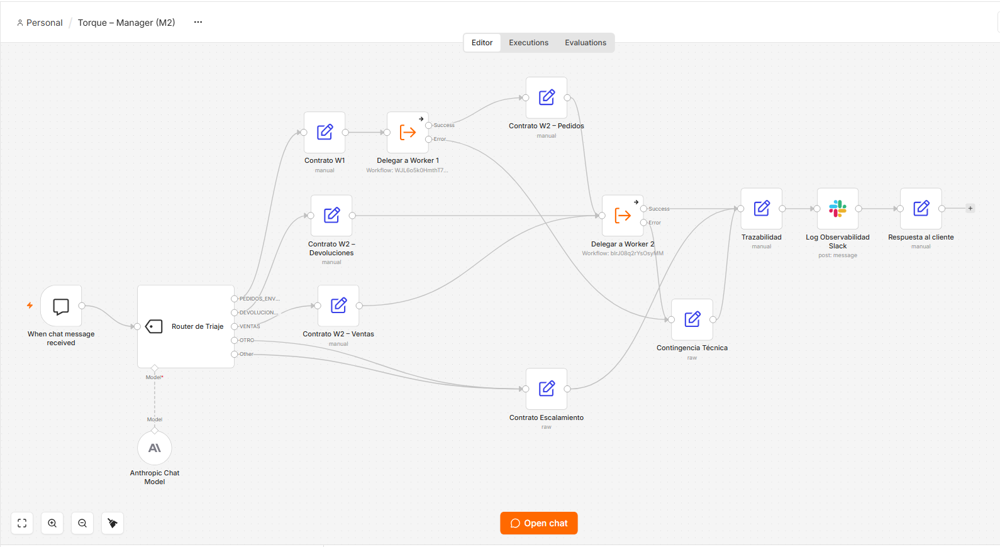
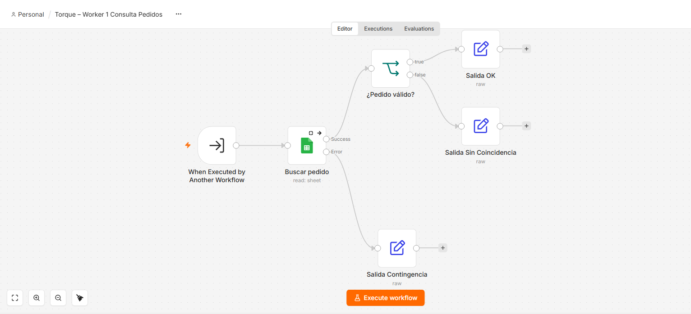
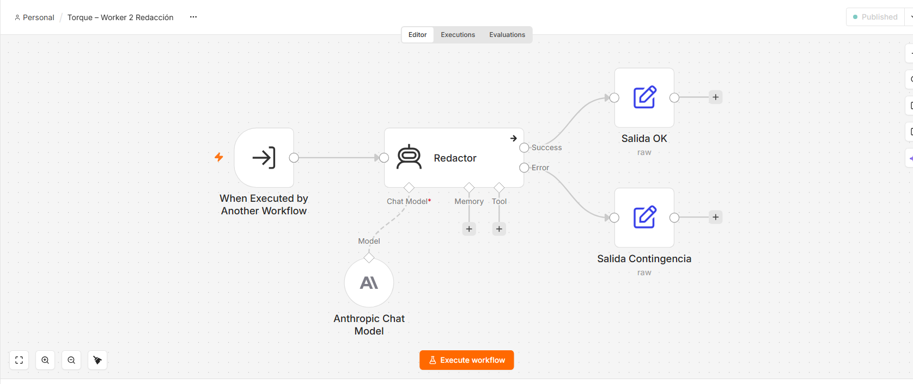
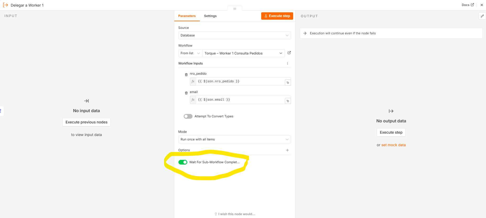
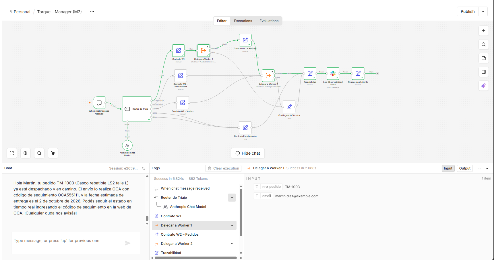
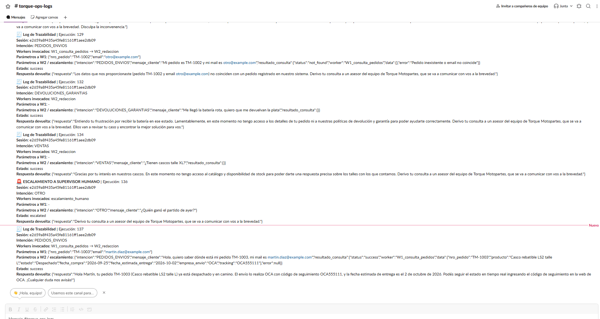

# Checkpoint 2 – Orquestación multi-agente con sub-workflows

Documento de entrega: [`preentrega_modulo2_saporiti_enzo.pdf`](preentrega_modulo2_saporiti_enzo.pdf)

## Caso de uso

El agente único del Módulo 1 se descompone en una arquitectura **Manager-Worker**:

- Un **Manager** recibe el mensaje del cliente, clasifica su intención en una taxonomía cerrada y delega la tarea.
- Dos **Workers** especialistas, implementados como sub-workflows independientes, resuelven cada uno una única tarea.

| Archivo | Workflow | Rol |
|---|---|---|
| [`manager_modulo2_saporiti_enzo.json`](manager_modulo2_saporiti_enzo.json) | Torque – Manager (M2) | Orquestador: clasifica, delega, consolida y registra |
| [`worker1_modulo2_saporiti_enzo.json`](worker1_modulo2_saporiti_enzo.json) | Torque – Worker 1 Consulta Pedidos | Busca el pedido y verifica el email (sin IA) |
| [`worker2_modulo2_saporiti_enzo.json`](worker2_modulo2_saporiti_enzo.json) | Torque – Worker 2 Redacción | Redacta la respuesta final al cliente (Claude Haiku 4.5) |

## Enrutamiento

| Intención | Recorrido |
|---|---|
| `PEDIDOS_ENVIOS` | Worker 1 → Worker 2 |
| `DEVOLUCIONES_GARANTIAS` / `VENTAS` | Worker 2 |
| `OTRO` / sin coincidencia clara | Escalamiento a supervisor humano |
| Falla o timeout de un Worker | Contingencia técnica + escalamiento |

## Contrato de datos

- **Manager → Worker 1:** `{ nro_pedido, email }`. Se extraen del mensaje con expresiones regulares, sin gastar tokens.
- **Manager → Worker 2:** `{ intencion, mensaje_cliente, resultado_consulta }`.
- **Salida de todos los Workers:** `{ status, worker, data, error }`.

El detalle completo de cada contrato está en el PDF.

## Credenciales necesarias

Son las mismas del Módulo 1: **Anthropic API**, **Google Sheets OAuth2** y **Slack API**. No se requieren credenciales nuevas.

## Cómo importar

1. Importá **primero los dos Workers**, con **⋯ → Import from File**.
2. En cada Worker, asigná tus credenciales:
   - Worker 1: Google Sheets. Seleccioná `Torque_Pedidos` y la hoja `pedidos`.
   - Worker 2: Anthropic.
3. Guardá y publicá cada Worker con **Publish**.
4. Importá el Manager y asigná las credenciales de Anthropic y Slack.
5. En los nodos `Delegar a Worker 1` y `Delegar a Worker 2`, volvé a seleccionar los Workers desde la lista. Al importar en otra cuenta, cambian los IDs.
6. Abrí el chat del Manager con **Open chat**.

## Prompts de prueba sugeridos

| Prompt | Resultado esperado |
|---|---|
| `Hola, quiero saber dónde está mi pedido TM-1003, mi mail es martin.diaz@example.com` | W1 → W2: informa estado, empresa de envío y tracking |
| `Mi pedido es TM-1002 y mi mail es otro@example.com` | W1 (not_found) → W2: no revela datos y escala |
| `¿Tienen cascos talle XL?` | VENTAS → W2: aclara que no tiene acceso al stock y escala |
| `¿Quién ganó el partido de ayer?` | OTRO → escalamiento directo, con alerta en Slack |

## Evidencia

**Manager:**

**Worker 1:**

**Worker 2:**

**Handoff con "Wait For Sub-Workflow Completion" activado:**

**Ejecución exitosa de punta a punta (#137):**

**Log de trazabilidad en Slack:**

