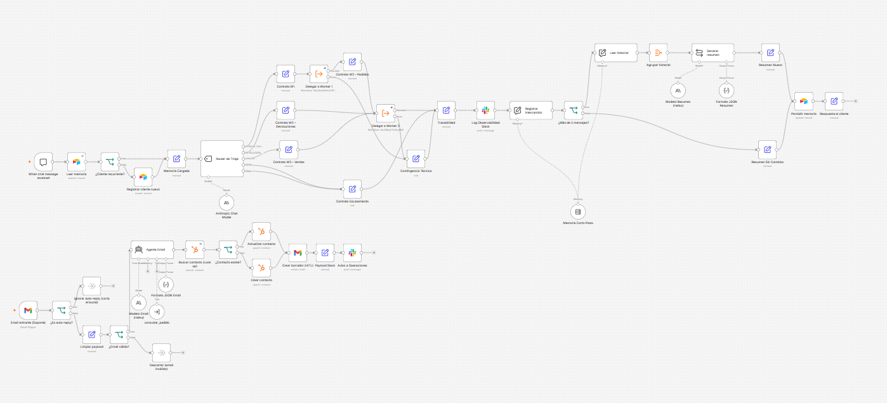
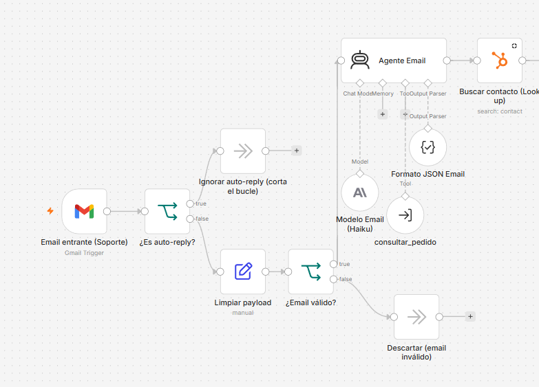
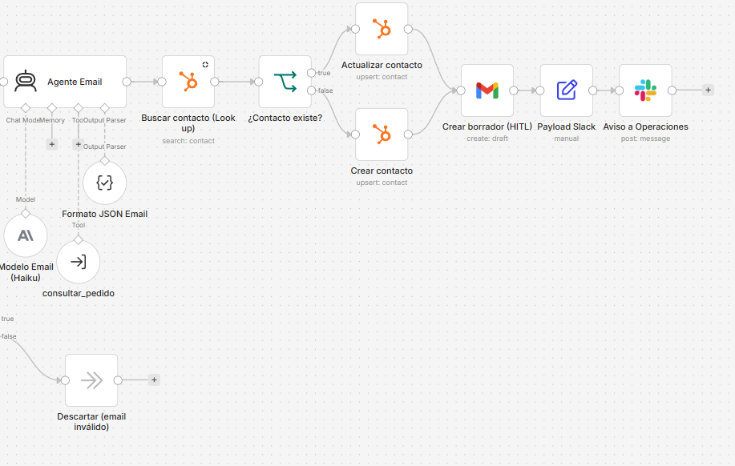
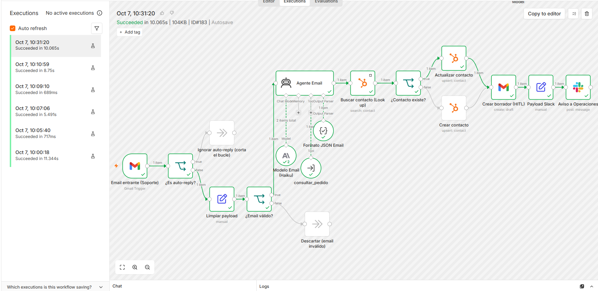
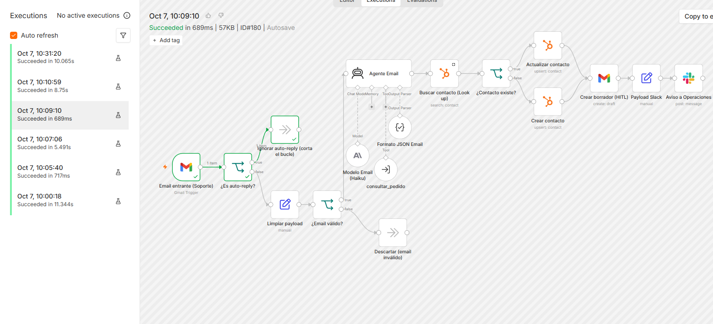
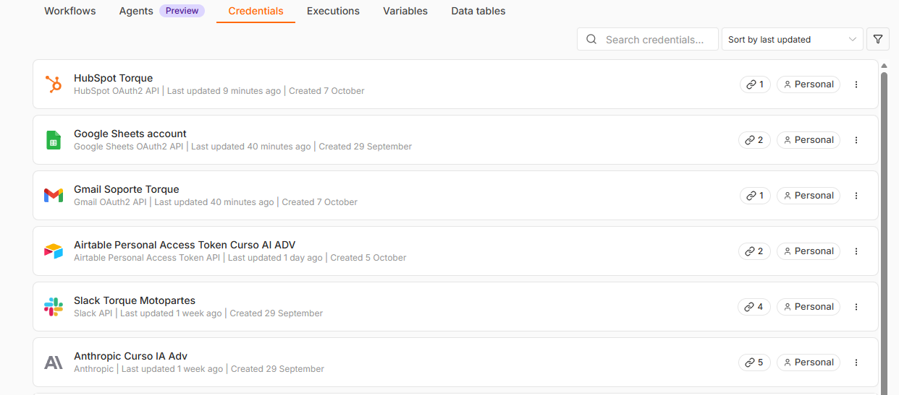
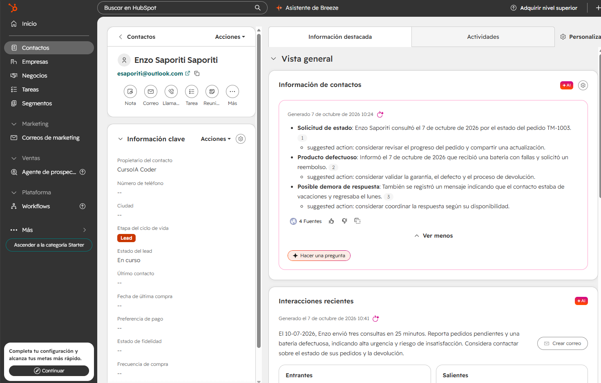
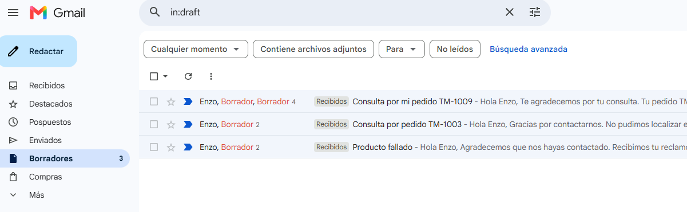
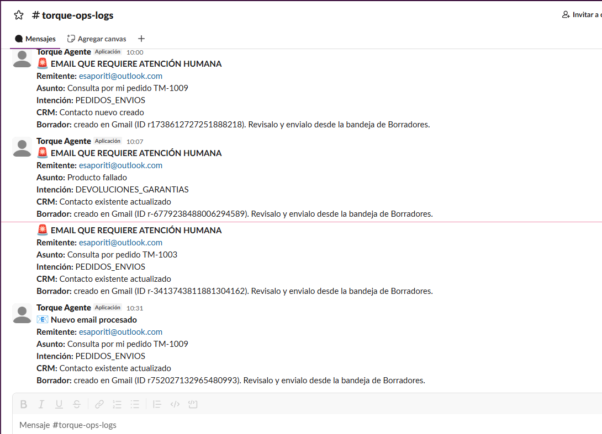

# Checkpoint 4 – Integraciones avanzadas e interconexión de sistemas

Archivo de entrega: [`checkpoint4_enzo_saporiti.json`](checkpoint4_enzo_saporiti.json). Se importa en n8n con **⋯ → Import from File**.

## Caso de uso

Se suma un **canal de email** al sistema agéntico de Torque Motopartes. Está conectado con el ecosistema real de la tienda, siguiendo el caso e-commerce de la clase en vivo:

| Pieza del vivo | Herramienta usada | Rol en el flujo |
|---|---|---|
| Casilla de soporte | **Gmail** (casilla dedicada de soporte) | Recibe los emails de clientes y guarda las respuestas como **borradores** |
| ERP / CRM (fuente única de verdad) | **HubSpot** (CRM gratuito) | Registro único de cada cliente: alta como Lead o actualización de seguimiento |
| Canal del equipo | **Slack** (`#torque-ops-logs`) | Avisa a Operaciones que hay un borrador para revisar |

El workflow parte del Manager del Módulo 3. **El canal chat sigue intacto**, y el canal email se agrega como una segunda puerta de entrada en el mismo lienzo. Los dos canales comparten el **Worker 1** de consulta de pedidos, que el agente de email usa como herramienta.

## Flujo del canal email

```
[Gmail Trigger] → ① [IF ¿Es auto-reply?] ─ Sí → [Ignorar: corta el bucle]
                        │ No
                        ▼
                  ④ [Set: Limpiar payload] → [IF ¿Email válido?] ─ No → [Descartar]
                        │ Sí
                        ▼
                  [Agente Email] (Claude Haiku 4.5 + tool consultar_pedido + salida JSON)
                        ▼
                  ② [HubSpot: Buscar contacto (Look up)] → [IF ¿Existe?] ─ Sí → [Actualizar contacto] ─┐
                                                                  └ No → [Crear contacto] ──────┤
                                                                                                 ▼
                                    ③ [Gmail: Crear borrador (HITL)] → [Set: Payload Slack] → [Slack: Aviso a Operaciones]
```

## Los 4 controles de la rúbrica

| # | Nodo | Qué previene | Cómo |
|---|---|---|---|
| ① | `¿Es auto-reply?` | Bucle infinito de respuestas automáticas | 7 condiciones en OR, sin distinguir mayúsculas. Asunto: Auto-reply, Out of office, Undeliverable, Respuesta automática. Remitente: no-reply, noreply, mailer-daemon |
| ② | `Buscar contacto (Look up)` | Error 409 (contactos duplicados) | Busca por email antes de escribir. Si existe, solo actualiza el seguimiento; si no existe, lo da de alta como Lead |
| ③ | `Crear borrador (HITL)` | Envíos sin control humano | Operación **Create Draft**: el agente nunca envía. El borrador queda dentro del hilo original para que un asesor lo apruebe |
| ④ | `Limpiar payload` + `¿Email válido?` | Error 400 (payload mal formado) | Del email solo pasan `from_email`, `from_nombre`, `subject`, `body_text` (cortado a 3.000 caracteres) y `thread_id`. Se valida el email con una expresión regular antes de llegar al CRM |

El Set de limpieza se ubica **antes** del agente, y no después como en el molde de la consigna. Así el modelo nunca recibe el payload crudo del email (HTML, cabeceras, metadatos), lo que reduce el costo de tokens y aplica el mismo criterio anti "Pasillo de la Muerte" del Módulo 2. Además, antes de Slack hay un segundo Set (`Payload Slack`) que envía solo datos mínimos, **sin el cuerpo del email**.

## Lectura, escritura y mínimo privilegio

| Conector | Autenticación | Lectura (pasado) | Escritura (futuro) | Mínimo privilegio aplicado |
|---|---|---|---|---|
| Gmail | OAuth2 | Emails no leídos de `INBOX` | Solo borradores | Casilla **dedicada** de soporte, no personal. El flujo nunca usa la operación de envío |
| HubSpot | OAuth2 | Búsqueda de contacto por email | Crear o actualizar contacto (email, nombre, etapa, estado del lead, mensaje) | Solo opera sobre el objeto Contactos. Permisos necesarios: `crm.objects.contacts.read` y `crm.objects.contacts.write` |
| Slack | Token de bot obtenido por el flujo OAuth 2.0 de instalación | — | Mensajes en un único canal | Scopes del bot: solo `chat:write` y `channels:read` |

**Seguridad adicional:** el email que recibe la tool `consultar_pedido` lo fija el sistema a partir del remitente real, no la IA. Aunque un email diga "soy otro cliente", no puede consultar pedidos ajenos.

## Credenciales necesarias para importarlo

Las de los módulos anteriores (**Anthropic**, **Google Sheets**, **Airtable** y **Slack**), más:
- **Gmail OAuth2 API:** iniciar sesión con la casilla de soporte.
- **HubSpot OAuth2 API:** con una cuenta del CRM gratuito.

Después de importar:
1. Asigná las credenciales en cada nodo.
2. En `consultar_pedido`, `Delegar a Worker 1` y `Delegar a Worker 2`, volvé a seleccionar los Workers desde la lista.
3. **No publiques el workflow para probarlo:** usá **Fetch Test Event** en el Gmail Trigger y ejecutalo a mano. Así se evita que la casilla se revise cada minuto y consuma tokens.

## Test de regresión

| Email de prueba | Resultado |
|---|---|
| "Consulta por mi pedido TM-1009" (primer envío) | Contacto **creado** en HubSpot, borrador generado y aviso 🚨 (el pedido no se encontró en ese intento) |
| "Producto fallado" (pide reembolso) | Contacto **actualizado**, sin duplicado. Borrador sin promesa de reembolso y aviso 🚨 |
| "Out of office: vuelvo el lunes" | Se **corta** en el IF (689 ms, 0 tokens). Sin CRM, sin borrador y sin aviso |
| "Consulta por pedido TM-1003" (pedido de otro cliente) | El borrador **no revela datos** del pedido ajeno. Aviso 🚨 |
| "Consulta por mi pedido TM-1009" (reintento) | Pedido verificado: borrador con estado, empresa de envío y tracking. Aviso 📧 |

Resultado en el CRM: **un único contacto** para el remitente, después de 4 emails procesados.

## Evidencia

**Lienzo completo del Manager M4 (canal chat arriba, canal email abajo):**



**Zona 1 – Filtros y agente:**



**Zona 2 – CRM, borrador y aviso:**



**Ejecución exitosa de punta a punta:**



**Auto-reply cortado en el IF:**



**Credenciales conectadas:**



**Contacto único en HubSpot:**



**Borradores para aprobación humana:**



**Avisos al equipo de Operaciones:**


