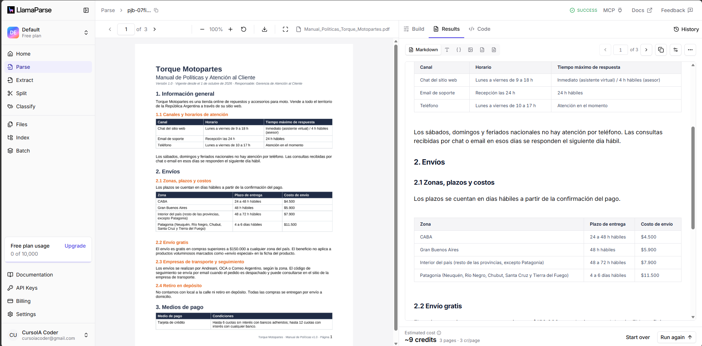
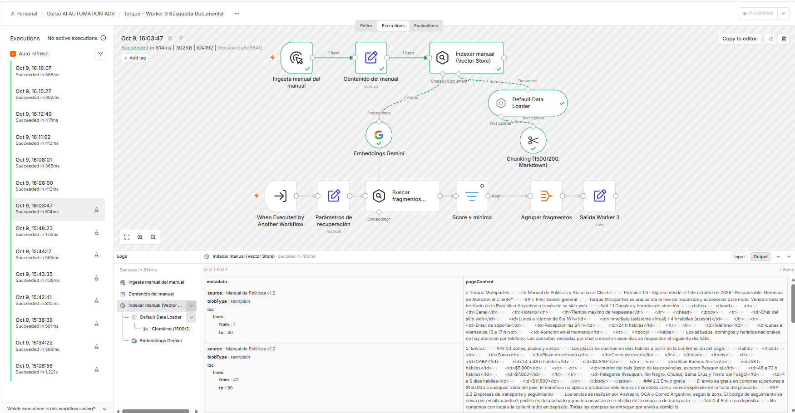
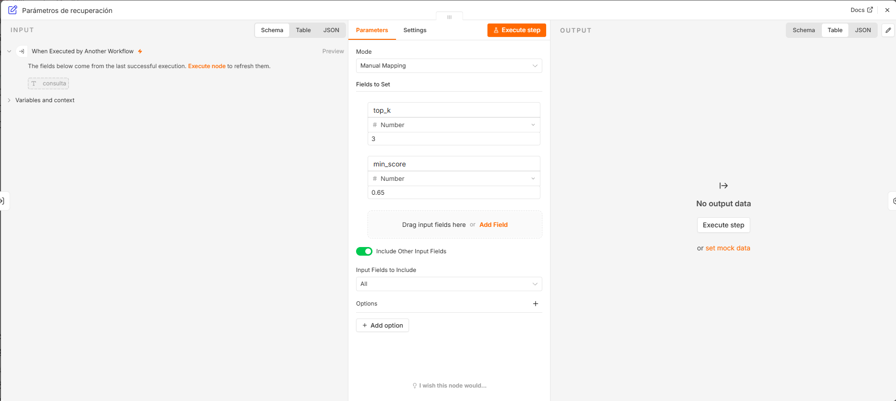
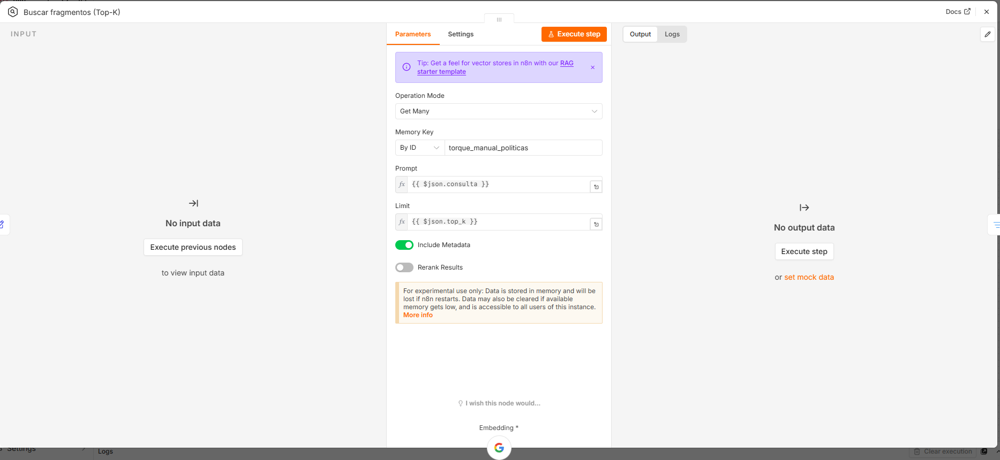
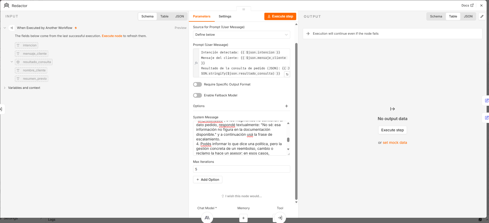
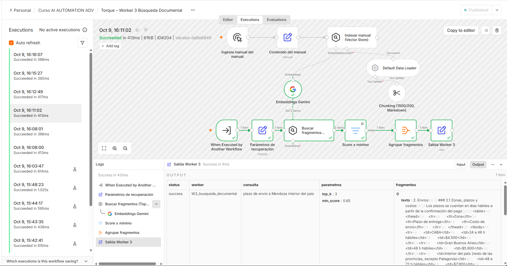
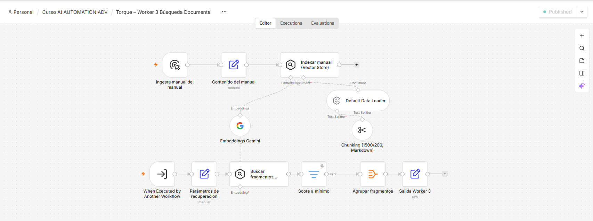
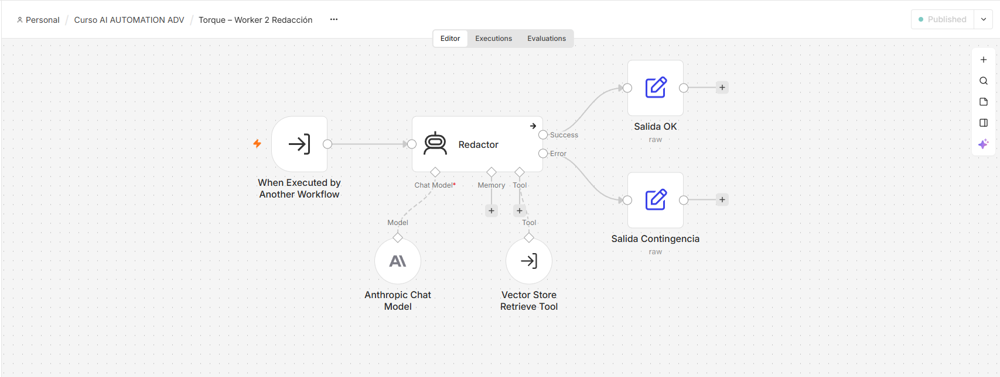
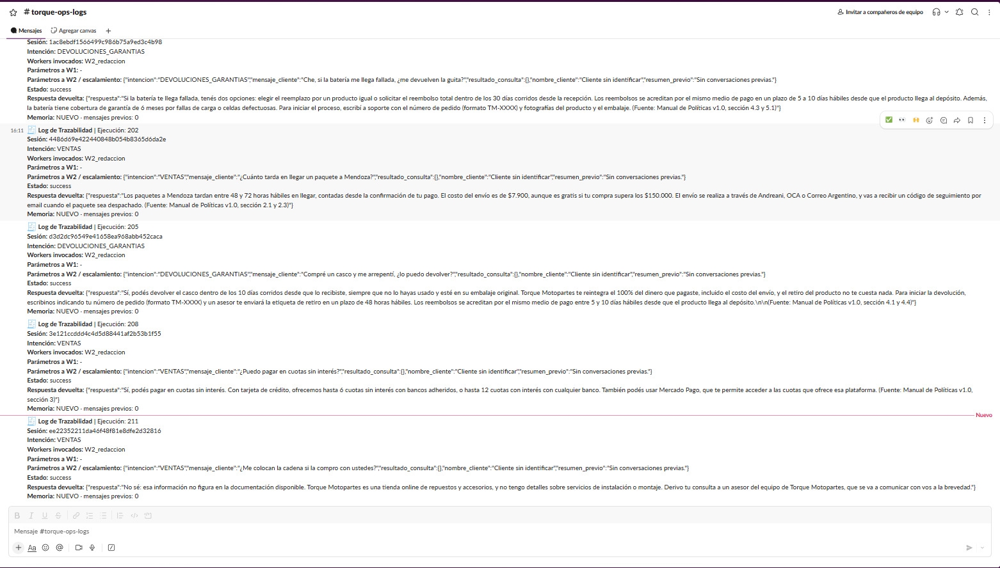

# Checkpoint 5 – Ingesta documental y cerebro documental (RAG)

Documento de entrega: [`PreEntrega_Modulo5_EnzoSaporiti.pdf`](PreEntrega_Modulo5_EnzoSaporiti.pdf)

## Caso de uso

El agente Redactor responde consultas sobre las políticas de Torque Motopartes (envíos, pagos, cambios, devoluciones y garantías) basándose **al 100% en el manual oficial de la tienda**. Cada respuesta cita la sección de la que sale el dato. Si la información no está en el manual, el agente responde **"No sé"** y deriva a un asesor.

Documento maestro: [`Manual_Politicas_Torque_Motopartes.pdf`](Manual_Politicas_Torque_Motopartes.pdf). La versión editable es el [`.docx`](Manual_Politicas_Torque_Motopartes.docx).

## Arquitectura

```
Cliente → Manager M5 → Router (VENTAS / DEVOLUCIONES_GARANTIAS) → Worker 2 (Redactor)
                                     └─ tool "Vector Store Retrieve Tool" → Worker 3 – Búsqueda Documental
                                           [top_k / min_score] → [Buscar fragmentos (Top-K)] → [Score ≥ mínimo] → [Salida JSON]
```

| Pieza | Herramienta | Configuración |
|---|---|---|
| Parseo | LlamaParse (plan gratuito, modo Cost-Effective) | Jerarquía de títulos y tablas preservadas. El Markdown se revisó y limpió antes de indexar |
| Embeddings | Google Gemini (plan gratuito) | Mismo modelo para la ingesta y para la búsqueda |
| Índice | Simple Vector Store de n8n | Clave `torque_manual_politicas`. Chunking de 1500/200 con separación por Markdown |
| Recuperación | Worker 3 | **Top-K = 3** y **Minimum Score = 0,65**. Devuelve `status` (`success` o `sin_resultados`) y los fragmentos con su score |

**Por qué no se usó el índice de LlamaCloud:** en el plan gratuito, LlamaCloud no permite crear la carpeta de origen que su índice necesita. Por eso el parseo se hizo en LlamaParse y el índice se armó en n8n, sin costo.

## Archivos

| Archivo | Workflow |
|---|---|
| [`manager_modulo5_saporiti_enzo.json`](manager_modulo5_saporiti_enzo.json) | Torque – Manager (M5), con el Router ajustado |
| [`worker2_modulo5_saporiti_enzo.json`](worker2_modulo5_saporiti_enzo.json) | Torque – Worker 2 Redacción, con la tool RAG y el prompt de citación y "No sé" |
| [`worker3_modulo5_saporiti_enzo.json`](worker3_modulo5_saporiti_enzo.json) | Torque – Worker 3 Búsqueda Documental, con la rama de ingesta y la de recuperación |

## Credenciales necesarias

Las de los módulos anteriores, más **Google Gemini (PaLM) Api**. Es una API key gratuita que se obtiene en aistudio.google.com.

## Cómo reproducirlo

1. **Parseá el manual:** subí el manual a LlamaParse y copiá el Markdown resultante.
2. **Importá el Worker 3 y cargá el índice:**
   - Pegá el Markdown en el nodo `Contenido del manual`.
   - Ejecutá la rama **Ingesta manual del manual**.
   - Publicá el workflow.
3. **Importá el Worker 2:** volvé a seleccionar el Worker 3 en `Vector Store Retrieve Tool` y publicá el workflow.
4. **Importá el Manager M5:** volvé a seleccionar los Workers en los nodos `Delegar a Worker 1` y `Delegar a Worker 2`.

El vector store es en memoria. Si la instancia de n8n se reinicia, hay que volver a ejecutar la rama de ingesta: tarda menos de un minuto y no tiene costo.

## Resultados de la prueba ciega

| Pregunta | Score | Resultado |
|---|---|---|
| ¿Me devuelven la guita si la batería llega fallada? | 0,731 (garantías) + búsqueda de devoluciones | ✓ Correcto, cita 4.3 y 5.1 |
| ¿Cuánto tarda en llegar a Mendoza? | 0,745 | ✓ 48 a 72 h hábiles (2.1) |
| Me arrepentí, ¿lo puedo devolver? | 0,749 / 0,698 | ✓ Arrepentimiento, 10 días (4.1) |
| ¿Puedo pagar en cuotas sin interés? | 0,780 | ✓ Hasta 6 cuotas sin interés (3) |
| ¿Me colocan la cadena? | sin resultados ≥ 0,65 | ✓ "No sé" + escalamiento |

| Métrica | Resultado |
|---|---|
| Precisión de recuperación | **5/5** |
| Exactitud factual | **5/5** |
| Cumplimiento de la regla de escalamiento | **3/5**. La acción correctiva está documentada en el PDF |

## Evidencia

**Parseo en LlamaParse:**



**Ingesta con el chunking final:**



**Parámetros de recuperación (Top-K y Minimum Score):**



**Configuración de la búsqueda de fragmentos:**



**System Prompt RAG:**



**Fragmentos recuperados con su score:**



**Lienzo del Worker 3:**



**Lienzo del Worker 2:**



**Logs de la prueba ciega en Slack:**


